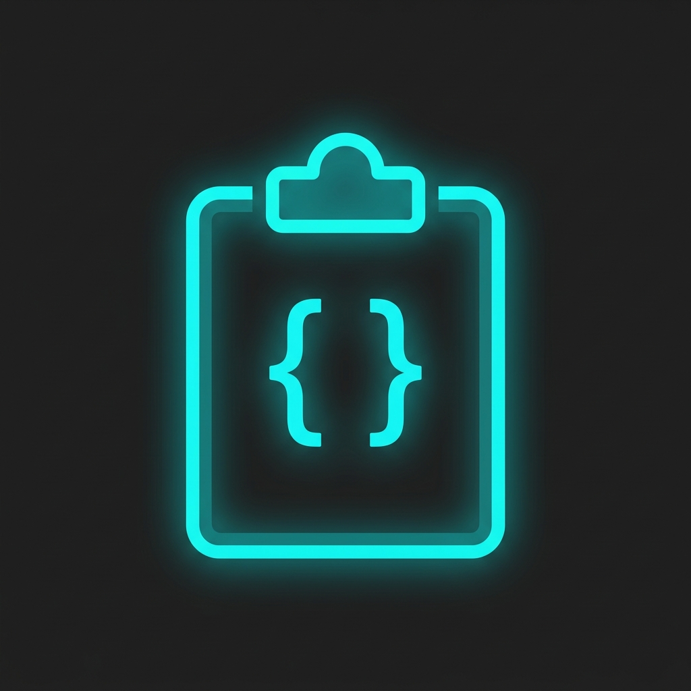

<div align="center">



# SnapSnip

**Save. Name. Reuse. Your personal code snippet vault — right inside VS Code.**

[](https://marketplace.visualstudio.com/items?itemName=zakiuhh.snapsnip)
[](https://marketplace.visualstudio.com/items?itemName=zakiuhh.snapsnip)
[](LICENSE)

[**Install from Marketplace**](https://marketplace.visualstudio.com/items?itemName=zakiuhh.snapsnip) · [Report a Bug](https://github.com/zakiuhh/snapsnip/issues) · [Request a Feature](https://github.com/zakiuhh/snapsnip/issues)

</div>

---

## 🤔 What is SnapSnip?

SnapSnip is a lightweight VS Code extension that lets you **snap** pieces of code and store them as named **snips** — so you can find and reuse them instantly, without digging through old files or bookmarks.

Think of it as your personal code notebook that lives right in VS Code's sidebar.

- ✅ No external accounts, no cloud, no setup
- ✅ Snippets survive VS Code restarts (stored in global state)
- ✅ Works with **every programming language** — language is auto-detected
- ✅ Snippets are shared across **all your workspaces**

---

## ✨ Features

### 📌 Save Any Code Snippet Instantly
Select any piece of code in your editor, press `Ctrl+Alt+S`, give it a name, and it's saved. That's it.

> Language is **automatically detected** — no need to specify Python, TypeScript, Rust, etc. SnapSnip reads whatever VS Code already knows.

### 🗂️ Browse Snippets in the Sidebar
A dedicated sidebar panel (accessible from the activity bar) organises all your snippets **grouped by language**, so you always find them fast.

### ⚡ Insert Snippets in One Click
Click any snippet in the sidebar and it's instantly pasted at your cursor position.

### 👁️ Preview with Syntax Highlighting
Right-click any snippet → **Preview Snippet** opens a beautiful Webview panel with full syntax highlighting and a **Copy to Clipboard** button.

### 🗑️ Delete Snippets Safely
Right-click → **Delete Snippet** shows a confirmation dialog before removing anything.

### 💾 Global & Persistent Storage
Your snippets are stored in VS Code's built-in global storage — they persist across **restarts, updates, and all projects**.

---

## 🚀 Getting Started

### Installation

**From the Marketplace (recommended):**
1. Open VS Code
2. Press `Ctrl+Shift+X` to open the Extensions panel
3. Search for **"SnapSnip"**
4. Click **Install**

**From VSIX (manual):**
1. Download the `.vsix` file from [Releases](https://github.com/zakiuhh/snapsnip/releases)
2. In VS Code, press `Ctrl+Shift+P` → type `Install from VSIX`
3. Select the downloaded file

---

## 📖 How to Use

### Step 1 — Save a Snippet

1. Open any file (Python, JavaScript, TypeScript, whatever you like)
2. **Select** the code you want to save
3. Press **`Ctrl+Alt+S`** (Mac: `Cmd+Alt+S`)
4. Type a descriptive name (e.g. `"Debounce function"`) and press `Enter`
5. Done! You'll see a confirmation toast ✅

> **Tip:** You can also save via the Command Palette:
> `Ctrl+Shift+P` → search `SnapSnip: Save Selected Snippet`

---

### Step 2 — View Your Snippets

Click the **SnapSnip icon** in the activity bar (left sidebar). You'll see all your snippets organised by language:

```
SnapSnip
└── python  (2 snippets)
    ├── Read CSV file
    └── Retry decorator
└── typescript  (3 snippets)
    ├── Debounce function
    ├── Deep clone object
    └── Format date
```

---

### Step 3 — Insert a Snippet

**Option A:** Click any snippet name in the sidebar → it's instantly inserted at your cursor.

**Option B:** Command Palette → `SnapSnip: Insert Snippet` → pick from a searchable list.

---

### Step 4 — Preview a Snippet

Right-click any snippet in the sidebar → **Preview Snippet**

A Webview panel opens on the side showing:
- The snippet name and language badge
- Full **syntax-highlighted** code
- A **📋 Copy to Clipboard** button

---

### Step 5 — Delete a Snippet

Right-click any snippet → **Delete Snippet** → confirm in the dialog.

---

## ⌨️ Keyboard Shortcuts

| Action | Windows / Linux | Mac |
|---|---|---|
| Save selected snippet | `Ctrl+Alt+S` | `Cmd+Alt+S` |

> The shortcut only activates when you have text selected in an editor (`editorTextFocus && editorHasSelection`), so it won't interfere with other tools.

---

## 🎮 All Commands

Access any command via the **Command Palette** (`Ctrl+Shift+P`):

| Command | Description |
|---|---|
| `SnapSnip: Save Selected Snippet` | Save the currently selected code as a named snippet |
| `SnapSnip: Insert Snippet` | Pick and insert a saved snippet at the cursor |
| `SnapSnip: Preview Snippet` | Open a snippet in a syntax-highlighted Webview |
| `SnapSnip: Delete Snippet` | Delete a saved snippet (with confirmation) |
| `SnapSnip: Refresh` | Manually refresh the sidebar tree |

---

## 🖼️ Screenshots

> Coming soon — run the extension and take screenshots of your setup!

---

## 🛠️ Requirements

- **VS Code** version `1.85.0` or higher
- No other dependencies — it just works!

---

## ⚙️ Extension Settings

SnapSnip currently works out of the box with no configuration needed.

> Future versions will add settings for custom storage location, snippet export/import, and more. See [Roadmap](#-roadmap).

---

## 🗺️ Roadmap

Here's what's planned for future versions:

- [ ] **Export / Import** snippets as a JSON file (for backup or sharing)
- [ ] **Edit snippet** inline in the sidebar
- [ ] **Search** across all snippets
- [ ] **Tags** for snippets (beyond language grouping)
- [ ] **Per-workspace** snippet collections as an optional mode
- [ ] **Snippet templates** with variable placeholders

Have an idea? [Open a feature request!](https://github.com/zakiuhh/snapsnip/issues)

---

## 🐛 Known Issues

- The icon PNG is slightly large (333 KB) — will be optimised in a future release.
- Highlight.js requires an internet connection for the Webview preview. Offline support coming soon.

---

## 📝 Changelog

See [CHANGELOG.md](CHANGELOG.md) for a full list of changes.

---

## 🤝 Contributing

Contributions are welcome! Here's how to get started:

```bash
# 1. Clone the repo
git clone https://github.com/zakiuhh/snapsnip.git
cd snapsnip

# 2. Install dependencies
npm install

# 3. Open in VS Code
code .

# 4. Press F5 to launch the Extension Development Host
```

Please open an issue before submitting a large pull request so we can discuss the approach first.

---

## 📄 License

MIT © [zakiuhh](https://github.com/zakiuhh)

See [LICENSE](LICENSE) for full details.

---

<div align="center">

Made with ❤️ for developers who hate repetition

**[⭐ Star on GitHub](https://github.com/zakiuhh/snapsnip)** if SnapSnip saves you time!

</div>
